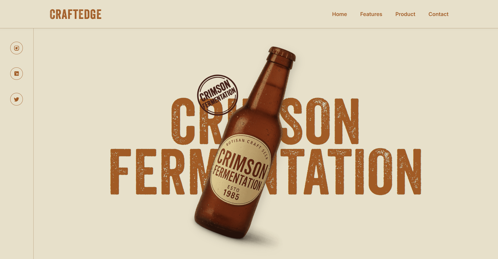

# 🍺 CraftEdge - Vintage Brewery Landing Page

[](#)
[](#)
[](#)
[](#)

CraftEdge is a responsive, animated landing page for a fictional vintage brewery brand — **Crimson Fermentation**.  
It features a rich storytelling design with smooth GSAP animations, a pinned hero product showcase, and a detailed ingredients & timeline section.

---
## 📸 Preview

  
---

## 📸 Live Demo

🔗 **[View Project on GitHub Pages](https://takshpatel02.github.io/craftedge/)**

---

## 🚀 Features

- **Modern UI & UX**

  - Custom typography pairing (`Veneer` + `Inter`)
  - Warm vintage color palette
  - Desktop & mobile-friendly layout

- **Interactive Animations**

  - Smooth entrance animations using **GSAP**
  - Scroll-based pinning & rotation effects for hero bottle
  - Timeline storytelling with alternating layouts

- **Responsive Design**

  - Fully optimized for mobile, tablet, and desktop
  - Mobile navigation with hamburger menu

- **Social Integration**
  - Fixed vertical social sidebar (desktop)
  - Horizontal footer-style social bar (mobile)

---

## 🛠 Tech Stack

- **HTML5**
- **CSS3**
  - Flexbox & responsive layouts
  - CSS variables for theme colors
- **JavaScript (Vanilla)**
- **GSAP** for animations
- **ScrollTrigger** for scroll-based effects

---

## 📂 Project Structure

```
index.html
style.css
script.js
Veneer.woff
imgs/
  ├── first batch.png
  ├── image-2.png
  ├── image.png
  └── stamp.png
```
